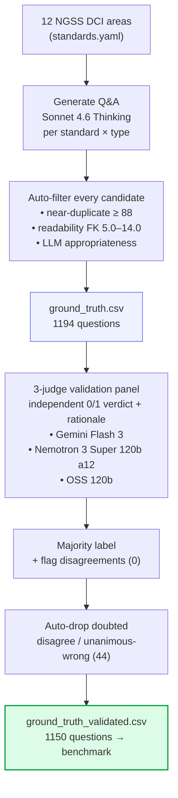

# Ground-truth dataset: how it was built
_Generated 2026-07-16 22:31 UTC._

## Overview
A ground-truth question–answer set for **12 NGSS high-school science areas** was generated by **Sonnet 4.6 Thinking** (target 100 questions/area, types: recall 33, conceptual 33, applied 34), then independently validated by a **3-judge LLM panel**: Gemini Flash 3, Nemotron 3 Super 120b a12, OSS 120b.

Every candidate question passed three automatic gates before entering the set: near-duplicate removal (rapidfuzz token-set ratio ≥ 88), a high-school readability band (Flesch–Kincaid 5.0–14.0), and an LLM appropriateness check; failures were dropped and regenerated for the same (area, standard, type) slot until the target was met.

## Pipeline

Steps (text)

1. **Standards** — 12 NGSS DCI areas (`data/standards.yaml`).
2. **Generate** — Sonnet 4.6 Thinking writes Q&A per standard × question type.
3. **Auto-filter** — dedupe + readability band + LLM appropriateness gate.
4. **ground_truth.csv** — 1194 questions kept.
5. **Validate** — 3 judges give independent 0/1 verdicts + rationale.
6. **Majority + flag** — disagreements flagged (0).
7. **Auto-drop** — doubted questions (disagreement or unanimous-wrong) removed automatically (44 dropped); recorded in `results/human_review/auto_dropped_groundtruth.csv`.
8. **ground_truth_validated.csv** — 1150 questions used by the benchmark.

## Counts
- Generated: **1194**
- Validated (final, used by benchmark): **1150**
- Auto-dropped as doubted (disagreement or unanimous-wrong): **44** (recorded in `results/human_review/auto_dropped_groundtruth.csv`; `ground_truth.csv` intact)
- Flagged for human review (judge disagreement): **0**
- Panel majority said *incorrect*: **0**

## Final composition by area
| area | title | questions | standards | recall | conceptual | applied | mean FK |
| --- | --- | --- | --- | --- | --- | --- | --- |
| HS-PS1 | Matter and Its Interactions | 99 | 8 | 33 | 33 | 33 | 10.28 |
| HS-PS2 | Motion and Stability: Forces and Interactions | 99 | 5 | 32 | 33 | 34 | 8.9 |
| HS-PS3 | Energy | 93 | 5 | 31 | 30 | 32 | 9.45 |
| HS-PS4 | Waves and Their Applications in Technologies for Information Transfer | 98 | 5 | 32 | 32 | 34 | 9.89 |
| HS-LS1 | From Molecules to Organisms: Structures and Processes | 98 | 7 | 32 | 33 | 33 | 10.06 |
| HS-LS2 | Ecosystems: Interactions, Energy, and Dynamics | 88 | 8 | 31 | 29 | 28 | 10.5 |
| HS-LS3 | Heredity: Inheritance and Variation of Traits | 94 | 3 | 32 | 31 | 31 | 9.68 |
| HS-LS4 | Biological Evolution: Unity and Diversity | 95 | 6 | 31 | 32 | 32 | 10.92 |
| HS-ESS1 | Earth's Place in the Universe | 95 | 6 | 31 | 32 | 32 | 9.56 |
| HS-ESS2 | Earth's Systems | 96 | 7 | 31 | 33 | 32 | 10.27 |
| HS-ESS3 | Earth and Human Activity | 98 | 6 | 32 | 32 | 34 | 10.54 |
| HS-ETS1 | Engineering Design | 97 | 4 | 31 | 32 | 34 | 11.51 |
| TOTAL |  | 1150 | 70 | 379 | 382 | 389 |  |

## Candidates rejected during generation
1,770 total.

| reason | rejected |
| --- | --- |
| readability out of band | 900 |
| LLM appropriateness gate | 605 |
| near-duplicate | 265 |

## Original judge agreement
Pairwise percent agreement (over items both judges scored; 1150 scored by all).

| judge | Gemini Flash 3 | Nemotron 3 Super 120b a12 | OSS 120b |
| --- | --- | --- | --- |
| Gemini Flash 3 | — | 100% | 100% |
| Nemotron 3 Super 120b a12 | 100% | — | 100% |
| OSS 120b | 100% | 100% | — |

### By judge model
| judge | items scored | said correct % | agreed w/ majority % |
| --- | --- | --- | --- |
| Gemini Flash 3 | 1150 | 100.0 | 100.0 |
| Nemotron 3 Super 120b a12 | 1150 | 100.0 | 100.0 |
| OSS 120b | 1150 | 100.0 | 100.0 |
